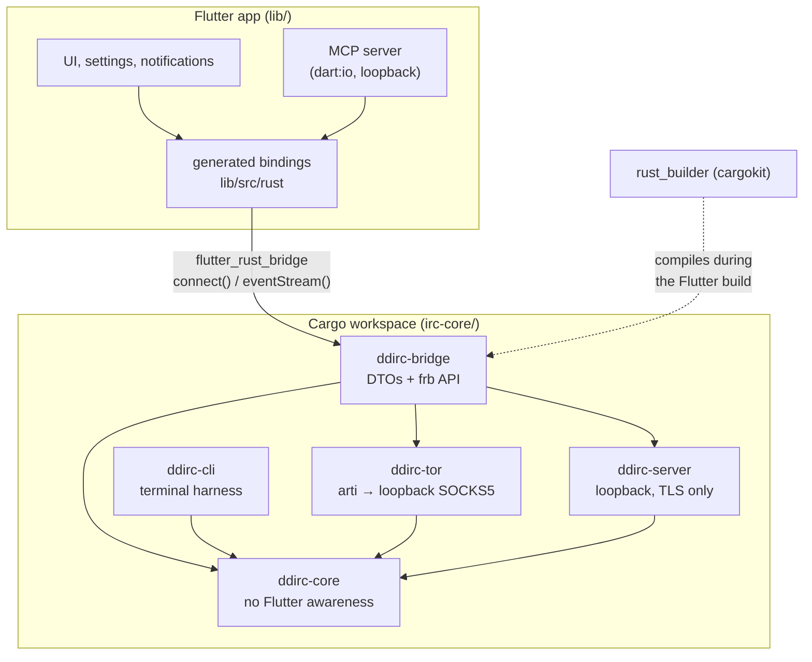
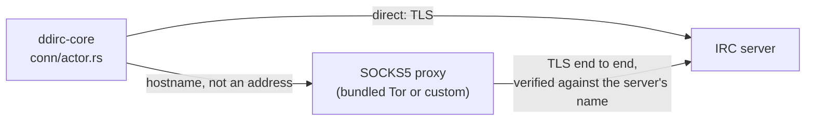
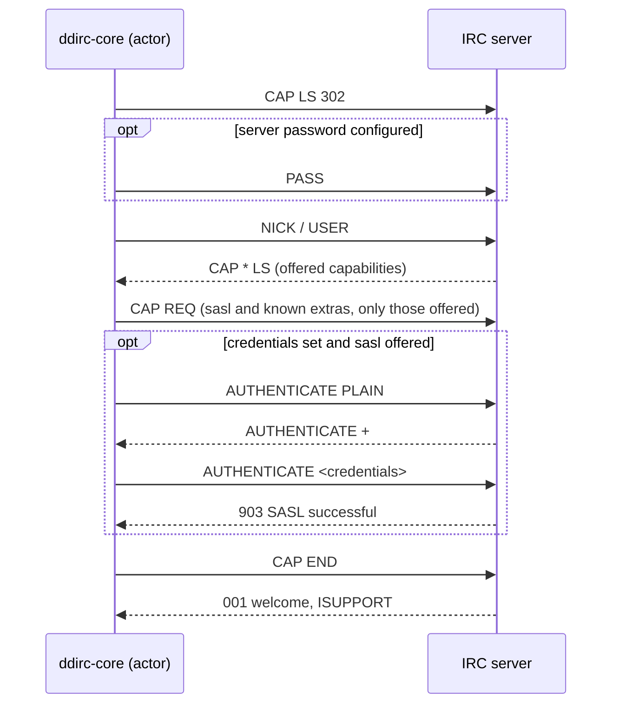

# Architecture and design

How the code is laid out, and the decisions behind it.

## Layout

The repository root **is** the Flutter application; the native side lives
beside it in one Cargo workspace.

```
ddIRC/
├─ lib/               # Dart UI + generated bindings under lib/src/rust
├─ assets/icon/       # the mark as PNG and SVG, generated
├─ tool/              # build-time scripts: make_icons.dart
├─ android/           # Flutter Android host
├─ windows/           # Flutter Windows host
├─ rust_builder/      # cargokit glue that builds Rust during a Flutter build
├─ irc-core/          # the Cargo workspace
│  ├─ ddirc-core/     # the reusable core — no Flutter awareness
│  ├─ ddirc-cli/      # terminal harness: the core with no Flutter in the way
│  ├─ ddirc-server/   # the local IRC server: loopback only, TLS only
│  ├─ ddirc-tor/      # the bundled Tor: arti behind a loopback SOCKS5 port
│  └─ ddirc-bridge/   # ddirc_bridge — the frb binding crate
└─ pubspec.yaml
```

`ddirc-core` knows nothing about Flutter or `flutter_rust_bridge`. The binding
crate `irc-core/ddirc-bridge` depends on it and owns every DTO that crosses into
Dart, which is what keeps the core reusable for desktop, CLI, and iOS
unchanged.



A connection leaves the core the same way whether or not a proxy is set; the
proxy only changes who carries the bytes, never who terminates TLS:



### Core modules

| Module | Responsibility |
|---|---|
| `api/` | The entire public surface. No `irc`-crate type escapes through it. |
| `conn/actor.rs` | Owns the connection; one tokio task, no shared mutable state. |
| `conn/sasl.rs` | IRCv3 capability negotiation and SASL PLAIN, as a pure state machine. |
| `conn/ratelimit.rs` | Token buckets for outgoing pacing and incoming flood protection. |
| `conn/reconnect.rs` | Exponential backoff with equal jitter. |
| `state/` | Channels, members, privileges; `ISUPPORT` and casemapping. |
| `dcc/offer.rs` | Parses an incoming `DCC SEND`. Built before anything that acts on one, because an offer is a string a stranger wrote. |
| `dcc/transfer.rs` | Moves the bytes, on its own socket and its own task. Holds the rule about what a transfer is allowed to disclose. |
| `media/` | Removing metadata from images before they are sent. No codec: each format is rewritten as a container, pixels copied across untouched. |
| `text/format.rs` | Parses mIRC formatting into styled spans and strips control codes, and writes them back out so the store can round-trip a line. |
| `conn/probe.rs` | One connection made to be reported on and thrown away — what *Test connection* runs. |
| `store/` | The message history database. Closed unless the user turned it on. |

`ddirc-server` is a separate crate rather than a module here, because it is the
other half of the protocol and wants dependencies the client half does not —
and because nothing that ships in the app should be able to reach it by
accident.

`ddirc-tor` is separate for the same reason and one more: it is 500 crates, and
keeping them behind one door means the core still builds and tests without
them. It ends at a loopback port, which is deliberate — the app has spoken
SOCKS5 to an external Tor since the proxy setting existed, so bundling one
added no second way for a connection to leave.

| Module | Responsibility |
|---|---|
| `identity.rs` | Issues the CA and mints a leaf per run. Holds the whole argument for why generating a certificate is safe where trusting a supplied one is not. |
| `state.rs` | Every command, every reply, and all the state. No sockets, no TLS, no timing — which is what makes it testable directly. |
| `session.rs` | One accepted connection: the TLS handshake, framing, and the reader and writer around it. |

## Why Rust, not C

The original design called for a C core wrapping `libircclient`. That turned out
not to be viable:

- **The named dependency does not exist.** `github.com/vitalyster/libircclient`
  returns 404, and no equivalent fork is on GitHub. The only surviving sources
  are a 2018 SourceForge tarball (autotools, no git) and `shaoner/libircclient`,
  frozen at v1.6.0 from 2013.
- **Its TLS is hardcoded to OpenSSL**, and OpenSSL does not support
  cross-compiling to Android from a Windows host — its own `NOTES-ANDROID` says
  to use a Unix host.

Rust removes both problems at once. The `irc` crate's `tls-rust` feature uses
**rustls**, which cross-compiles to Android from Windows with nothing but the
NDK — verified, producing working `arm64-v8a` and `armeabi-v7a` libraries with
zero OpenSSL references. Safe Rust also eliminates by construction the entire
class of memory-safety requirements the original C plan had to enforce by
discipline.

(rustls is not literally 100% Rust: its default crypto provider `aws-lc-rs`
contains C and assembly. It needs no external toolchain beyond the NDK's own
clang, which is the property that actually mattered here — OpenSSL's Android
build wanted perl, make, and a Unix shell.)

Go was considered and rejected. [`girc`](https://github.com/lrstanley/girc) is
the best-maintained IRC library in any language right now, but the Go runtime
installs signal handlers that conflict with the Dart and ART VMs, cgo's pointer
rules constrain callbacks, and no Go↔Flutter bridge approaches
`flutter_rust_bridge`'s health.

## Design notes

**We drive registration ourselves.** The `irc` crate's `identify()` sends
`CAP END` *before* `NICK`/`USER`, which closes capability negotiation before SASL
could run. The actor therefore sends the registration burst itself and lets
`conn/sasl.rs` decide when negotiation ends.



**SASL is ours.** The crate has no SASL support at all — only a `nick_password`
field for NickServ. We implement SASL PLAIN over its `CAP`/`AUTHENTICATE`
commands, exactly as [Halloy](https://github.com/squidowl/halloy) does. NickServ
remains the fallback when a server does not offer SASL or refuses it, and the UI
is told which happened, because the fallback is genuinely weaker: it
authenticates *after* connecting, so you are briefly present unauthenticated.

**We re-align MODE parameters.** The crate's `takes_arg` table is hardcoded and
claims `-l` carries a parameter, which it does not. On `MODE #c -l+o bob` that
shifts every later argument and grants ops to the wrong member. We keep only the
*order* of modes and arguments — which the crate does preserve — and re-align
them against the server's advertised `CHANMODES`.

**Casemapping is respected.** IRC nicks are case-insensitive, and under RFC 1459
`[]\` are the uppercase forms of `{}|`. Comparing with plain ASCII lowercase
would treat `Foo[bar]` and `foo{bar}` as two different users on a network that
considers them one.

**Motion is a token, not a per-widget decision.** `lib/src/ui/motion.dart` holds
three durations and two curves, read as `context.motion` — the same shape as the
colour tokens, for the same reason. The getter returns zero durations when the
platform's *reduce motion* setting is on, so honouring that is automatic instead
of something every call site has to remember. Nothing animates for decoration:
each transition answers *what just changed, and where did it go*. The one
looping animation is the status dot while a connection is pending, because amber
alone cannot tell "still trying" from "settled".

**Size is a token too.** `lib/src/ui/layout.dart` names three widths —
`compact`, `medium`, `expanded` — measured once at the top of the tree and read
as `context.layout`. Widgets ask it questions (`layout.channelsPinned`,
`layout.gutter`) rather than comparing pixel widths, because a breakpoint
buried in a widget is one nobody else can find, and the panes only read as one
app if they all change their mind at the same width. Three rather than two
because there are two independent decisions: the channel list earns its place
early, the member list only once the conversation between them is still wide
enough to read. Below `compact` the rail and the channel list share one
drawer — they answer the same question, so on a phone they are one button.

**The splash is shy.** Startup draws nothing for the first 140ms, so a warm
start never flashes a logo; if it does appear it stays long enough to be read.
It exists mostly for the case that used to produce an empty window and no
explanation: a native core that will not load now gets a sentence, the
underlying error, and a retry.

**A failure should say which hop broke.** A proxy doubles the number of
machines that can refuse a connection, and both refusals arrive as the words
"connection refused". They are fixed in completely different places, so
`conn/diagnose.rs` is told whether a proxy was in use and answers accordingly:
an unreachable proxy says nothing was sent to the server at all, a refusal
relayed through SOCKS5 names both the proxy and the destination, and something
on the port that is not SOCKS5 says so outright — pointing this at an HTTP
proxy is the commonest way to get there, and "Invalid response version" gives
no hint of it. The same instinct removes advice as well as adding it: "check
the address for a typo" is wrong under a proxy, because the name was never
ours to resolve.

**An error should name the thing that fixes it.** The `irc` crate's `Display`
for its most common error is, in full, `an io error occurred` — with the real
`io::Error` attached as a `#[source]` it never prints. So a mistyped hostname,
a firewall, a wrong port and a server that is simply down all reached the user
looking identical, and none of them suggested what to do. `conn/diagnose.rs`
classifies the error instead of printing it, names the host and port that
failed, and says what usually fixes that case; where it cannot classify one it
walks the source chain, which at minimum recovers the detail the crate dropped.
The same instinct applies at the other boundary: `AnyhowException.toString()`
is `AnyhowException(msg)`, with parentheses rather than a colon, so the tidy-up
that was meant to strip the wrapper silently matched nothing and users saw it.
It is unwrapped by type now, not by regex over a `toString`.

**A new message moves pixels, never layout.** `Arrive` fades and lifts a row
into place with a `Transform`, which costs no layout at all. That is not a
performance choice. The scrollback jumps to `maxScrollExtent` whenever a
message lands and you are already at the bottom, so an entry animation that
grew the row would move that target while the jump was being computed and
strand the newest line half off the screen. Two conditions have to agree
before a row animates — it has to be past the end of what was on screen last
build, *and* it has to have happened in the last second. The index alone
replays the tail every time you scroll back to it; the timestamp alone makes a
channel you join mid-conversation flash its whole backlog at once.

## Dependency posture

The `irc` crate (577★, 407k downloads) is the de-facto standard for Rust, but
upstream moves slowly — 36 open issues and an 8-month gap at the time of writing.
Both serious downstream users, [Halloy](https://github.com/squidowl/halloy) and
`repartee`, vendor their own in-tree fork.

We depend on the published crate and treat vendoring as a **planned escape
hatch**, not a surprise. IRC is a frozen protocol, so a fork carries no ongoing
maintenance tax. If we hit the gaps they hit — flood protection, rustls
behaviour — the fork goes in `irc-core/vendor/irc` and nothing else changes.

`tray_manager` is the Dart side's only new dependency, and it is the companion
to `window_manager`, which was already here. It exists because hiding a window
without a way back is not a feature; nothing else in the tree needed a native
tray, and writing one for three platforms to avoid one pinned package would
have been the worse trade.

The local server added **two crates**, `yasna` and `time`, both pulled in by
`rcgen`. Everything else it needs was already here: `irc-proto` is what the
`irc` client crate is built on, so the server parses and writes exactly what
the client does instead of carrying a second implementation to keep in step,
and `rustls` and `tokio-rustls` arrive with `tls-rust`.

`rcgen` is the judgement call. X.509 could have been hand-rolled the way
`media/` hand-rolls its containers, and the reason it was not is that the
calculus differs: a container written slightly wrong shows up as a file that
will not open, whereas a certificate written slightly wrong is fed to a
verifier that has to accept it *and* has to go on refusing what it should
refuse. That is not the place to save a dependency.

The Android foreground service added **nothing**. A notification, a channel and
a permission are three framework APIs behind version guards, which is less code
than reading a plugin's changelog — and one fewer thing between the app and a
permission it has to justify to a store.

The `.irc` file format added **one dependency that was already there**: `yaml`
was pulled in transitively by our own tooling and is promoted to a direct
dependency purely to parse an import reliably — writing one back out is a
schema small and fixed enough to hand-roll, see `lib/src/model/ircconfig.dart`,
so no writer package was added alongside it. QR scanning added
[`mobile_scanner`](https://pub.dev/packages/mobile_scanner), which was
unavoidable: nothing already in the tree reads a camera, and it earns its
place by owning the Android permission prompt itself rather than asking this
app to plumb one more manual `MethodChannel` flow beside the two it already
maintains for notifications and the background service.

The proxy support is the crate's own `proxy` feature, backed by
`tokio-socks`. We take `tokio-socks` as a direct dependency as well, because
`conn/diagnose.rs` matches on its error variants and the `irc` crate does not
re-export the type — matching on Display strings instead would be one upstream
rewording away from silently losing every proxy diagnosis.

Message history added **one crate that matters**, `rusqlite`, and it is taken
with `bundled` on purpose. The alternative was a system SQLite, which means a
different version — or none — on each of the five platforms this cross-compiles
for, and a database file whose readability depends on which machine wrote it.
Compiling the amalgamation costs build time and buys one answer everywhere. The
Dart-side alternatives (`sqlite3`, `drift`) were the other way to do it and were
rejected for splitting persistence across two languages rather than for anything
about the packages; `sqlx` wants an async runtime the store does not need, and
`diesel` is an ORM over a schema with one table.

The agent server added **nothing**: `dart:io` already has an HTTP server, and
the part of MCP it speaks — JSON-RPC over one POST — is smaller than any SDK's
changelog.

`Cargo.lock` is committed and `cargo audit` runs over the whole tree. See
[SECURITY.md](../SECURITY.md).

Dependencies are checked on a schedule rather than when someone remembers:
Dependabot opens grouped pull requests for Dart, Rust and the CI actions on the
first of every second month (`.github/dependabot.yml`), and `make outdated`
asks the same question locally. The rusqlite pin travels with arti's, and the
flutter_rust_bridge crate and Dart package move together or not at all — both
are called out in the config, where a bot would otherwise split them.

## The mark

A hash on a rounded square. `#` is the channel sigil — it is what an IRC
address looks like, it predates every other use of the character, and unlike a
wordmark it is still legible at sixteen pixels.

Drawn by hand rather than set in type: four gentle curves, each with its own
weight and lean, small inside a round periwinkle field — soft at launcher
sizes, and comfortably inside Android's adaptive-icon safe zone.

It is described once, as numbers, in `lib/src/ui/mark_spec.dart`: four curves
(start, control point, end, width) and a corner radius, every value a fraction
of the side. Two things read it.
`AppMark` paints it on the splash and the empty screen, and
`tool/make_icons.dart` rasterises it into every launcher icon — the Windows
`.ico` at seven sizes, Android's legacy and adaptive icons at five densities,
the tray icons under `assets/tray/`, Android's notification icon at five
densities, and a PNG and SVG under `assets/icon/` for anywhere outside a
build.

The tray is the one place the mark ships as a Flutter asset, because a tray is
a native control and takes a file rather than a widget. Windows and Linux get
the mark as it appears everywhere else, since the icon sits beside the taskbar
button and should be the same thing. macOS gets a *template* — the hash alone,
one ink on transparency — because the menu bar recolours what it is given, and
an image that is not a template comes out as a smudge on a dark bar and a
different smudge on a light one.

Android's status bar wants exactly the same silhouette, for exactly the same
reason: it keeps only the alpha channel and tints the rest. So the notification
icon *is* the macOS template, drawn at Android's densities.

```bash
make icons     # redraw them all; the output is committed
```

Each size is *drawn* at that size from signed distance fields rather than
downscaled from one master, which is why the 16px taskbar icon keeps its
counters. `flutter test` re-renders and compares bytes, so changing the spec
without rerunning the generator fails a test instead of shipping a stale icon.
